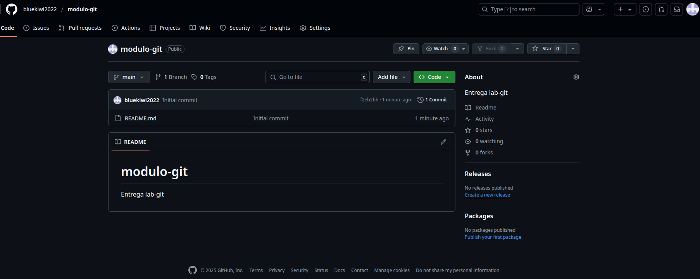

# modulo-git

Entrega lab-git

**Primero:**

-Instalo git en pc y abro mi cuenta

**Segundo:**

-Creo carpeta mkdir modulo-git
-Inicializo mediante el comando: git init

**Tercero:**

Creo repositorio en gitHub

**Cuarto**
