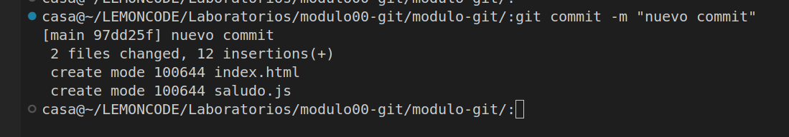
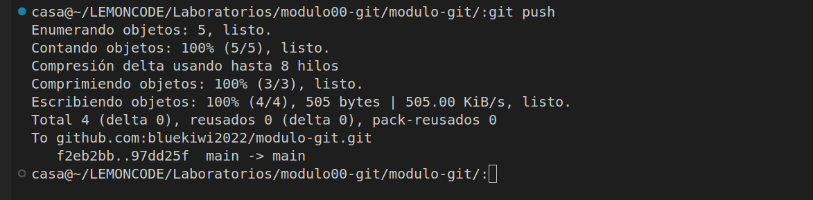
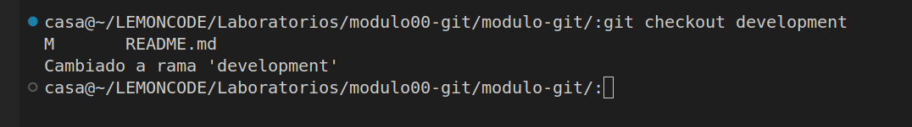
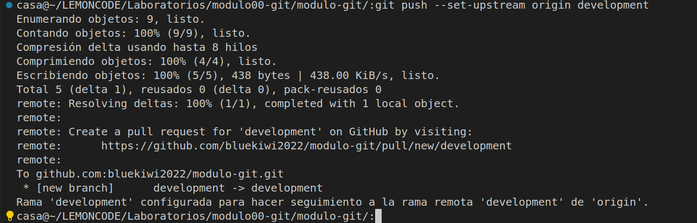
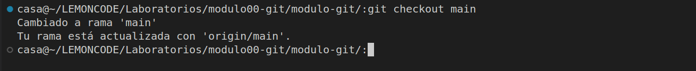
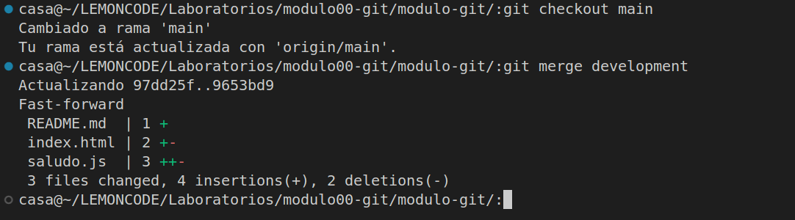

# modulo-git

Entrega lab-git

**Primero:**

-Instalo git en pc y abro mi cuenta

**Segundo:**

-Creo carpeta mkdir modulo-git
-Inicializo mediante el comando: git init

**Tercero:**

Creo repositorio en gitHub

**Cuarto**

- Creo archivo en carpeta:

-       index.html y saludo.js
        -Los añado a staging mediante add.

- Creo un commit descibiendo los cambios con git commit -m "descripcion"

- Subo los cambios a github mediante un git push

**Quinto**

-Creo rama "development" mediante comando: git branch nombrerama y cambio de rama mediante el comando: checkout nombreRama

-Realizo cambios en rama en archivo y los subo.

    con git push --set-upstream origin development

**Sexto**

-Vuelvo a la rama main con: git checkout main

-Hago un merge a la rama development mediante comando: git merge development

-Finalizo haciendo un push --set-upstream development

Finalizo laboratorio
